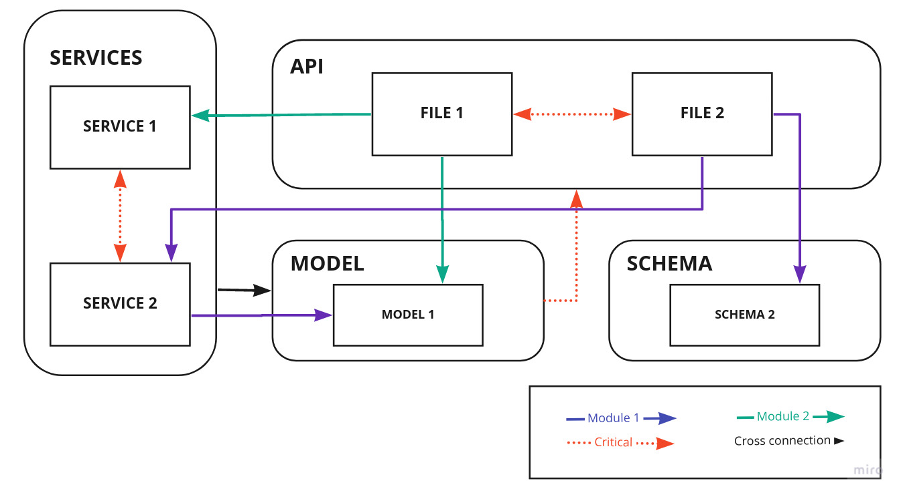
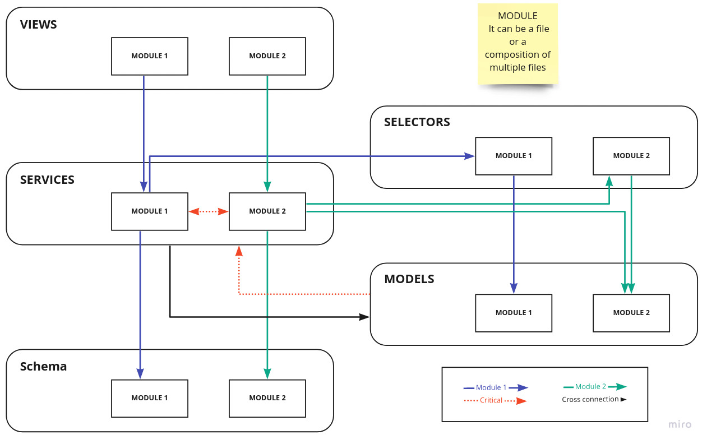
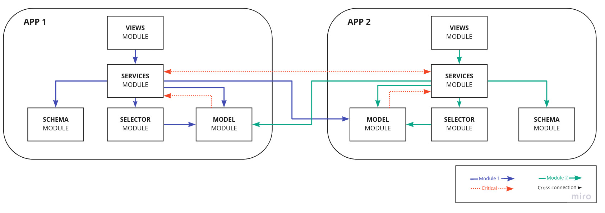

<style>
    h2, h1 {
    color: white;
    }
</style>


# Project re-structuration <!--fit-->


---

### Table content

- [Current structure](##Current-structure)
- [File types proposal](##File-types-proposal)
- [Functional based structure](##Functional-based-structure)
- [App based structure](##App-based-structure)
- [Analysis](##Analysis)
- [References](##References)

---

## Current structure
---
```markdown		
API
    - File1-module
    - File2-module
MODELS		
    - Model1
    - Model2
SERVICES		
    - File1-module
    - File2-module
SCHEMA		
    - File1-module
    - File2-module
```



---


## File types proposal
---

| File      | Description               |
| ---       | ---                       |
| Models    | Database models           |
| Services  | Business logic            |
| Selectors | Data access orm services  |
| Schema    | Validate Python data structures   |
| Views     | Logic that respond to requests to the application |


---

## Functional based structure

---
```markdown		
VIEWS
    - Settings	
        - File1-module
    - Company	
        - File1-module
MODELS		
    - Settings	
        - File1-module
    - Company	
        - File1-module
SCHEMAS		
    - Settings	
        - File1-module
    - Company	
        - File1-module
```



---

## App based structure

---
```markdown
SETTINGS	
    - services.py
    - views.py
    - selectors.py
    - schema.py
    - models.py
	
COMPANY	
    - services.py
    - views.py
    - selectors.py
    - schema.py
    - models.py
```


---

## Analysis

---


### [FUNCTIONAL BASED](https://www.reetro.app/board/6148ea45f1da6a00178348a9/6148eb06f1da6a00178348ed) VS [APP BASED](https://www.reetro.app/board/6148ea45f1da6a00178348a9/6148ec3ef1da6a0017834915)


---

### Questions
- What to do with the classes that are highly coupled?
- When has a file to be splitted?
- How should be grouped the files which are part of the same category? EX: services -> File1/File2

---

### Considerations
- **Test** are going to **keep apart from the other files** as it is today, but it should adopt internally the **same structure of the main folder**
- Each function needs is own **test class** if we are doing **unittesting**

---


---
#### References
- [Structuring Large Applications In Flask Using Blueprints](https://levelup.gitconnected.com/structuring-a-large-production-flask-application-7a0066a65447)

- [Structuring a Large Production Flask Application](https://levelup.gitconnected.com/structuring-a-large-production-flask-application-7a0066a65447)

- [Ideal Flask project structure for absolutely scalable web application in 2021](https://codersdiaries.com/blog/flask-project-structure)

- [Best Practices for Flask API Development](https://auth0.com/blog/best-practices-for-flask-api-development/)

- [Structure of a Flask Project](https://lepture.com/en/2018/structure-of-a-flask-project)